# Snapo

A cute photobooth that runs in the browser. Pick a ready made design, shoot with your webcam, crop and filter each photo, decorate if you like, then save it or scan a QR code to get the soft file on your phone. Photos stay on your device unless you choose to make a QR link.

- Live: https://marvelcollin.github.io/Snapo/
- Preview of the `dev` branch: https://marvelcollin.github.io/Snapo/dev/

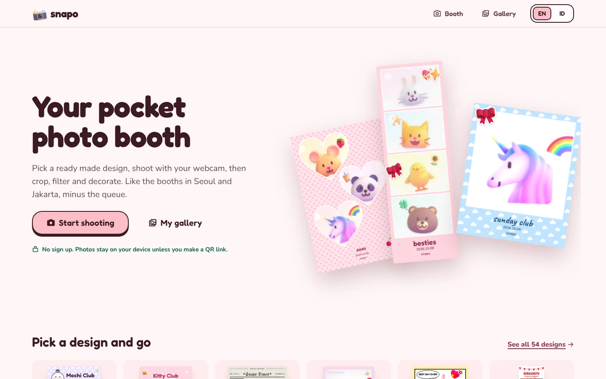

## Screenshots

| Pick a design | Shoot with a countdown |
|---|---|
| 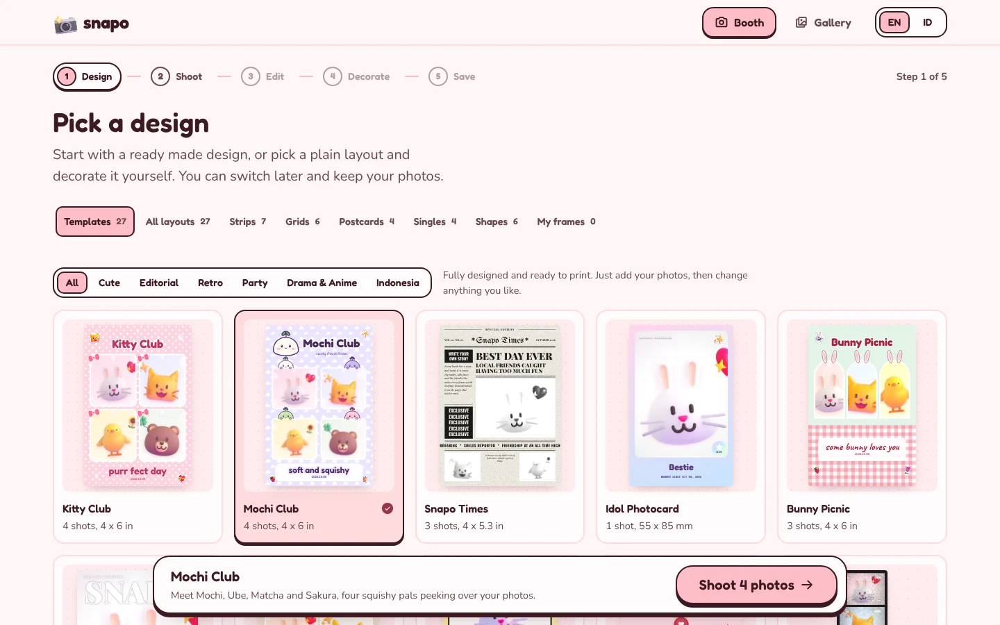 | 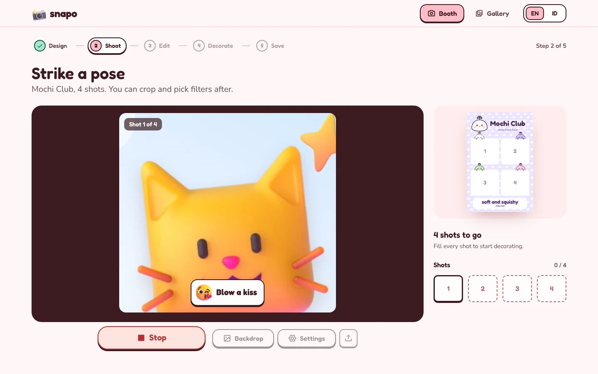 |
| **Crop and filter each photo** | **Decorate with stickers** |
| 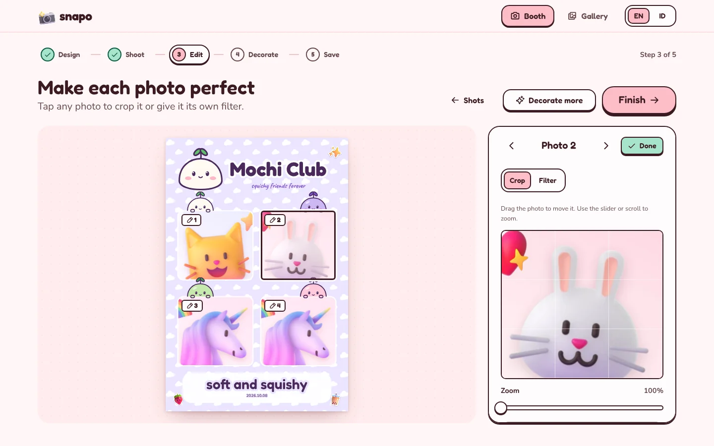 | 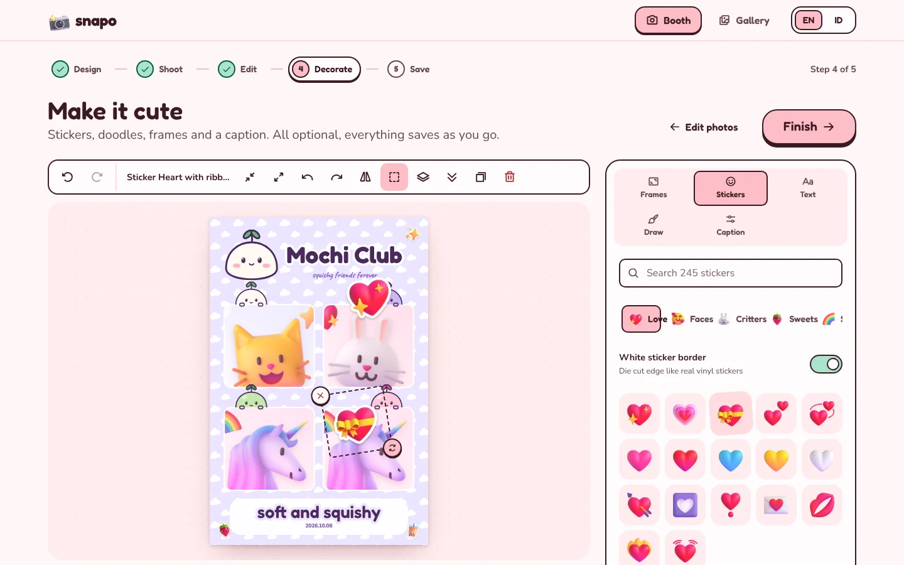 |
| **Save, share or make a QR code** | **Your local gallery** |
| 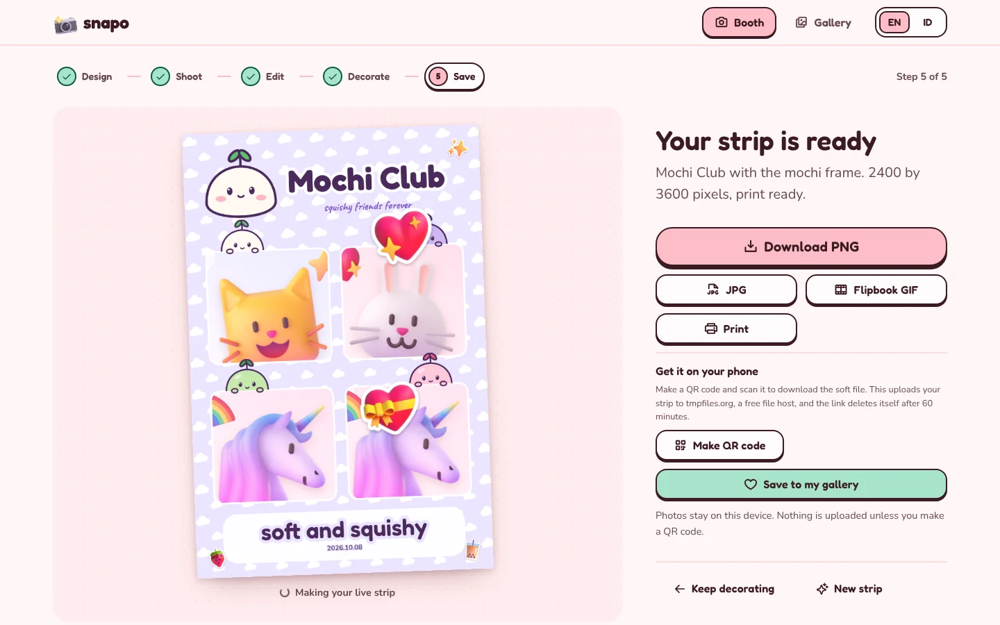 | 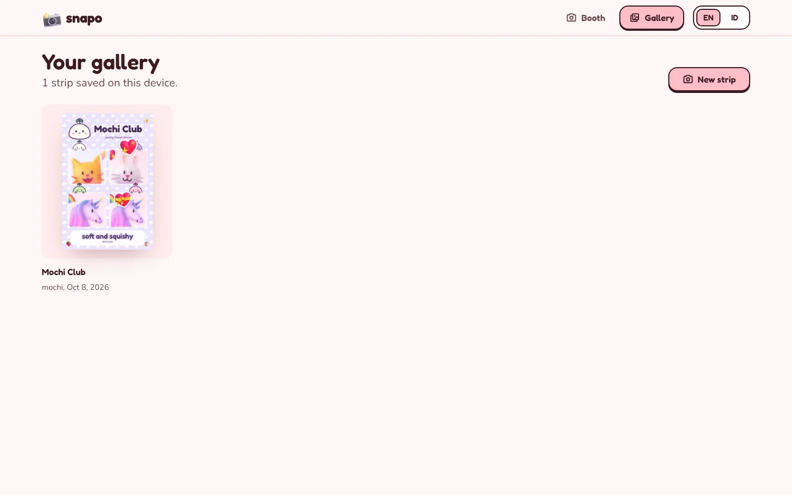 |

### Brand templates

Mochi Club, Snapo Pop, Snapo O's and Snapo Records. Mochi and the pals are an original mascot made for Snapo.

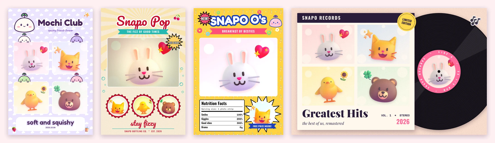

### Drama and anime templates

Time Slip 98, First Snow, Subtitled, Drama Poster and Shoujo Manga, inspired by the moods of Korean dramas and anime.

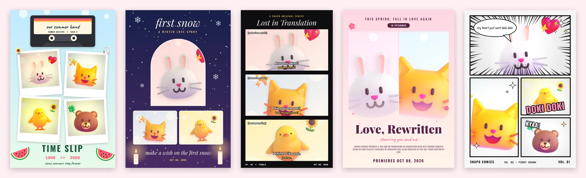

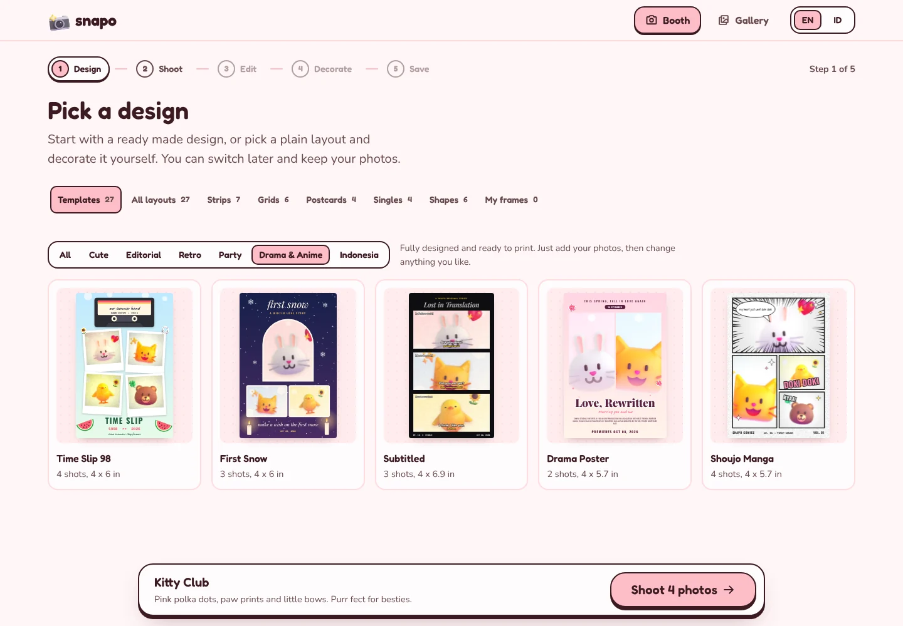

### Chibi mood templates

Ribbon Bakery, Haori Night, Say It Twice and Melon Stars. Each one has original chibi characters that carry the mood of a show: a sweet shop in the Hello Kitty mood, a Taisho era night in the Kimetsu no Yaiba mood, an airmail postcard in the Can This Love Be Translated mood and a summer school band in the Twinkling Watermelon mood.

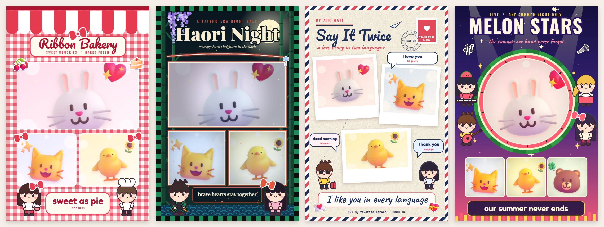

### On your phone

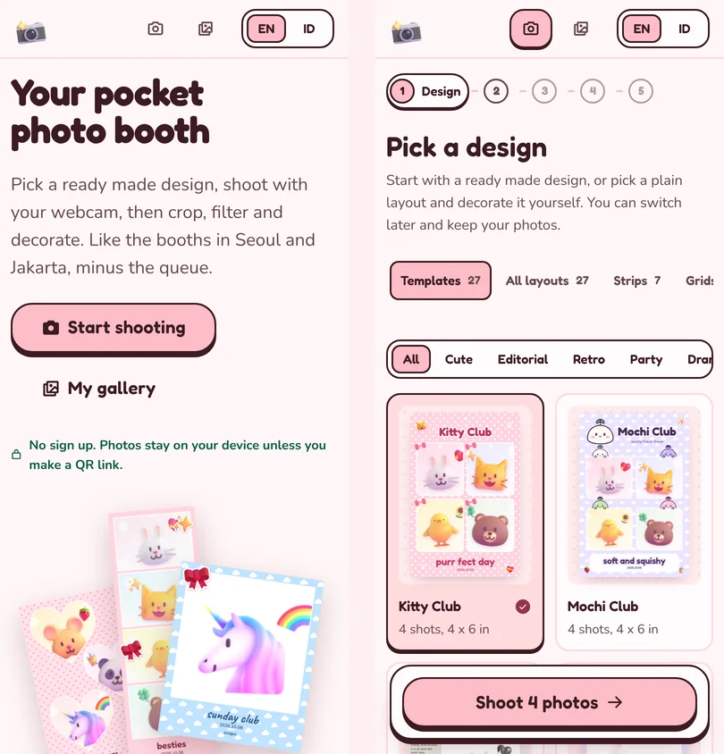

## How a session goes

1. **Design:** start from one of 31 complete templates, or pick a plain layout to decorate yourself
2. **Shoot:** countdown, pose ideas, studio backdrops and live photo clips, with every setting on one screen
3. **Edit:** tap any photo on the strip to crop it or give it its own filter
4. **Decorate (optional):** frames, stickers, text, doodle pens and caption style
5. **Save:** PNG, JPG, GIF, live strip, share, print, local gallery, or a QR code for your phone

## Features

- **Templates:** 31 fully designed sheets that only need your photos, such as Snapo Times newspaper, Cover Story magazine, Kitty Club, Mochi Club, Ribbon Bakery, Bunny Picnic, Bear Cafe, Idol Photocard, Comic Pop, Love Letter, Camcorder, Film Roll 400, Movie Night ticket, Snapo Mart receipt, Snapo Air boarding pass, Snapo Pop soda ad, Snapo Records vinyl sleeve, Snapo O's cereal box, Pocket Player, Birthday Bash, Class Of, Time Slip 98, First Snow, Subtitled, Drama Poster, Shoujo Manga, Haori Night, Say It Twice, Melon Stars, Dirgahayu for 17 Agustus and Lebaran Day. Grouped into Cute, Editorial, Retro, Party, Drama & Anime and Indonesia
- **Layouts:** 27 plain strips, grids, postcards, singles and shapes, plus your own uploaded frames
- **Look:** 50 filters you can set per photo, a soft skin slider, and studio backdrops (color, pattern or blur) powered by on-device segmentation
- **Decorate:** 68 frame themes including batik, seigaiha waves, haori check, air mail, Lebaran, Imlek and 17 Agustus, 207 stickers, 50 word stickers, text and doodle pens (marker, neon, outline, rainbow, sparkle)
- **Save:** PNG, JPG, flipbook GIF, live strip as video or GIF, share, print, a local gallery and a QR download link
- **Languages:** English and Bahasa Indonesia
- **SEO:** page titles per route, meta description, Open Graph and Twitter cards, JSON LD structured data, a web manifest with app icons, prerendered route pages, `robots.txt` and `sitemap.xml`

### QR download

On the Save step, **Make QR code** uploads a JPG of the finished strip to [tmpfiles.org](https://tmpfiles.org), a free file host, and shows a QR code for its link. Scanning it opens a page where the phone can download the soft file. The file is deleted after 60 minutes. Nothing is uploaded until that button is pressed.

### Your own frame

Design a frame in Canva or any editor, leave the photo spots transparent and export it as a PNG. In the booth, open Design, go to **My frames** and upload it. Snapo finds the see-through spots and turns them into photo slots. A sheet with two matching strips side by side (like a 4R print cut in half) reuses the same photos in both strips.

## Run

```bash
npm install
npm run dev
```

The camera needs `localhost` or https.

## SEO

The build adds everything search engines and link previews need, driven by `scripts/seo-plugin.ts` and the route list in `vite.config.ts`.

- `index.html` holds the title, description, canonical link, Open Graph and Twitter tags, and `WebApplication` structured data. `__SITE_URL__` is replaced with `SITE_URL` (default `https://marvelcollin.github.io/Snapo/`)
- `/booth/layout/` and `/gallery/` are written as real pages with their own title and description, so they answer with status 200 instead of going through `404.html`
- `robots.txt` and `sitemap.xml` are generated into `dist` on every build with the build date as `lastmod`
- Builds whose base path is not the site path, such as `/Snapo/dev/`, get `noindex` and a `robots.txt` that blocks everything, so previews never compete with the live site
- In the app, `usePageMeta` keeps `document.title`, the description and `<html lang>` in sync with the route and language
- `public/og-image.png` is the 1200 x 630 share card, and `public/site.webmanifest` lets the booth install as an app

For a project site on GitHub Pages, crawlers read `robots.txt` only from the domain root, so submit `https://marvelcollin.github.io/Snapo/sitemap.xml` in Google Search Console as well.

## Deploy

`.github/workflows/deploy.yml` publishes to GitHub Pages on every push to `main` or `dev`. Each run builds only the branch that was pushed and writes it into the `gh-pages` branch, `main` at the root and `dev` under `/dev/`, leaving the other one untouched. Every publish is a new commit, so a fast forwarded `main` is always picked up.

- Set **Settings > Pages > Source** to **Deploy from a branch**, branch `gh-pages`, folder `/`
- The build reads `BASE_PATH` (for example `/Snapo/dev/`) and the router uses it as its basename
- `public/404.html` sends deep links such as `/Snapo/booth/shoot` back to the app, and a small script in `index.html` restores the address
- `node_modules` is cached by lockfile hash, so a deploy without dependency changes skips `npm ci`
- `gh-pages` is pushed with a lease and retried, so a `main` and a `dev` deploy running together cannot overwrite each other
- Only the SIMD build of the segmenter is bundled. Browsers without wasm SIMD (Safari before 16.4) load the fallback from jsDelivr, pinned to the installed MediaPipe version

## Project structure

```
src/
  main.tsx, App.tsx      entry and routes only
  pages/                 one file per route, default export
    booth/               the five booth steps and BoothShell, the booth route wrapper
  components/            named exports, one component per file
    app/                 app chrome such as the header
    ui/                  generic building blocks (Button, Dialog, Popover, Slider, ...)
    shared/              product pieces used on more than one screen
    layout/ shoot/ edit/ decorate/ save/   pieces that belong to one booth step
  hooks/                 React hooks, one per file
  store/                 zustand stores, one per domain
  lib/                   plain TypeScript logic with no React
  i18n/                  en.ts and id.ts hold every piece of UI copy
  styles/                one stylesheet per area, plus base.css and tokens.css
  data/                  generated data such as the sticker manifest
  types/                 type declarations for untyped packages
public/                  static files, kebab-case names
scripts/                 node scripts and the SEO build plugin, kebab-case names
docs/screenshots/        images used in this readme
```

Templates live in two files. `lib/layouts.ts` holds each template's sheet size and photo slots, and `lib/templates.ts` holds its frame, filter, caption and stickers. The printed artwork, like the newspaper masthead or the boarding pass fields, is drawn in `lib/templateArt.ts`.

### Naming rules

| What | Rule | Example |
|------|------|---------|
| Component file | PascalCase, named after the one component it exports | `components/edit/CropEditor.tsx` |
| Page file | PascalCase ending in `Page`, or `Step` inside the booth, default export | `pages/booth/ShootStep.tsx` |
| Hook file | camelCase starting with `use`, one hook per file | `hooks/useSegmenterStatus.ts` |
| Store file | camelCase domain name, exports `useDomain` | `store/customFrames.ts` exports `useCustomFrames` |
| Logic file | camelCase topic, no React imports | `lib/frameUpload.ts` |
| Stylesheet | lowercase area name | `styles/decorate.css` |
| Static asset or script | kebab-case | `public/models/selfie-segmenter.tflite` |
| CSS class | BEM style, `block__element--modifier` | `.edit__spot.is-active` |

UI copy never lives in components or data. Add the key to `src/i18n/en.ts` first, and TypeScript will then require the same key in `id.ts`. Proper names such as filter, frame and layout names stay in the data files and are not translated.

## Credits

- Sticker art from [Microsoft Fluent Emoji](https://github.com/microsoft/fluentui-emoji), MIT License. Refresh with `node scripts/fetch-stickers.mjs`.
- Backdrops use the [MediaPipe selfie segmenter](https://ai.google.dev/edge/mediapipe/solutions/vision/image_segmenter), Apache 2.0, which runs fully in the browser.
- Fonts from [Fontsource](https://fontsource.org), SIL Open Font License.
- QR codes by [qrcode-generator](https://github.com/kazuhikoarase/qrcode-generator), MIT License.
- The Kitty Club and Mochi Club templates and the Mochi mascots are original designs and are not affiliated with any character brand.
- Snapo Pop, Snapo O's, Snapo Records, Snapo Mart and Snapo Air are made up brands. The drama and anime templates are inspired by the moods of specific shows, credited in the template descriptions. All characters and art are original chibi drawings made for Snapo, with no official art, logos or real people's likenesses. Snapo is not affiliated with any show, studio or brand.
